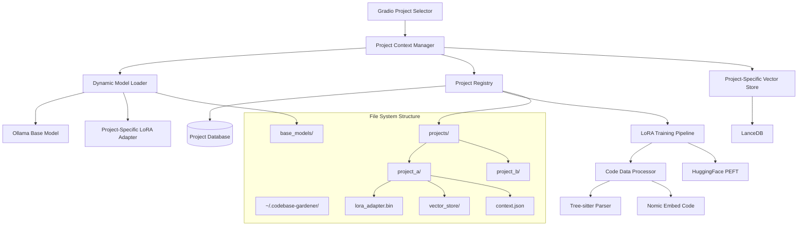

# Design Document

## Overview

The Codebase Gardener MVP is designed as a project-switching system that provides specialized AI analysis for different codebases through LoRA (Low-Rank Adaptation) adapters. The core architecture centers around dynamic model loading, where each codebase gets its own specialized LoRA adapter trained on that specific project. Users can switch between projects via a Gradio interface, and the system dynamically loads the appropriate LoRA adapter and project-specific vector store to provide tailored code analysis.

The system emphasizes local processing on Mac Mini M4 hardware for privacy, efficient resource utilization through dynamic model loading/unloading, and specialized analysis capabilities that understand the unique patterns and context of each codebase rather than providing generic code analysis.

## Architecture

### High-Level Architecture



### Project Structure

```
codebase-gardener-mvp/
├── pyproject.toml
├── README.md
├── requirements.txt (generated)
├── .gitignore
├── .python-version
├── src/
│   └── codebase_gardener/
│       ├── __init__.py
│       ├── main.py
│       ├── config/
│       │   ├── __init__.py
│       │   ├── settings.py
│       │   └── logging_config.py
│       ├── core/
│       │   ├── __init__.py
│       │   ├── project_registry.py
│       │   ├── project_context_manager.py
│       │   ├── dynamic_model_loader.py
│       │   └── lora_training_pipeline.py
│       ├── models/
│       │   ├── __init__.py
│       │   ├── ollama_client.py
│       │   ├── peft_manager.py
│       │   └── nomic_embedder.py
│       ├── data/
│       │   ├── __init__.py
│       │   ├── parser.py
│       │   ├── preprocessor.py
│       │   └── project_vector_store.py
│       ├── ui/
│       │   ├── __init__.py
│       │   ├── gradio_app.py
│       │   ├── project_selector.py
│       │   └── components.py
│       └── utils/
│           ├── __init__.py
│           ├── file_utils.py
│           ├── error_handling.py
│           └── directory_setup.py
├── tests/
│   ├── __init__.py
│   ├── conftest.py
│   ├── test_config/
│   ├── test_core/
│   ├── test_models/
│   ├── test_data/
│   ├── test_ui/
│   └── test_utils/
├── docs/
│   ├── setup.md
│   ├── usage.md
│   └── api.md
└── scripts/
    ├── setup_environment.py
    └── download_models.py
```

## Components and Interfaces

### Configuration Management

**Purpose**: Centralized configuration handling with environment variable support and validation.

**Key Components**:

- `settings.py`: Main configuration class using Pydantic for validation
- `logging_config.py`: Structured logging configuration
- Environment variable override support
- Default configuration with user customization

**Interface**:

```python
class Settings(BaseSettings):
    # Application settings
    app_name: str = "Codebase Gardener"
    debug: bool = False
    log_level: str = "INFO"

    # Model settings
    ollama_base_url: str = "http://localhost:11434"
    default_embedding_model: str = "nomic-embed-code"

    # Storage settings
    data_dir: Path = Path.home() / ".codebase-gardener"
    vector_db_path: Path = data_dir / "vector_store"

    class Config:
        env_prefix = "CODEBASE_GARDENER_"
```

### Core Services

**Project Registry**:

- Manages multiple processed codebases and their metadata
- Tracks LoRA adapter training status and model versions
- Provides fast lookup and filtering of available projects
- Handles project lifecycle (add, remove, update, retrain)

**Project Context Manager**:

- Maintains separate conversation states for each project
- Handles context switching between projects
- Manages project-specific analysis history and preferences
- Implements intelligent context pruning for memory efficiency

**Dynamic Model Loader**:

- Efficiently loads and unloads LoRA adapters based on project selection
- Manages memory usage through intelligent model caching
- Handles adapter compatibility verification with base models
- Provides fallback mechanisms when adapters fail to load

**LoRA Training Pipeline**:

- Orchestrates the training of project-specific LoRA adapters
- Processes codebase data for training dataset creation
- Manages training progress and resource allocation
- Handles training failures and retry mechanisms

### Model Management

**Ollama Client**:

- Manages connection to local Ollama instance
- Handles model loading and inference
- Provides retry logic and error handling

**PEFT Manager**:

- Manages Parameter Efficient Fine-Tuning workflows
- Handles model adaptation for specific codebases
- Provides training and inference interfaces

**Nomic Embedder**:

- Specialized code embedding generation
- Optimized for code semantic similarity
- Batch processing capabilities

### Data Processing

**Tree-sitter Parser**:

- Multi-language code parsing
- AST generation and traversal
- Code structure extraction

**Preprocessor**:

- Code normalization and cleaning
- Chunk generation for embedding
- Metadata extraction

**Vector Store**:

- LanceDB integration
- Efficient similarity search
- Metadata filtering and querying

### User Interface

**Gradio Application**:

- Web-based interface for codebase interaction
- Real-time analysis results
- Project management interface

**Components**:

- File browser for codebase navigation
- Search interface for semantic queries
- Visualization components for analysis results

## Data Models

### Project Configuration

```python
@dataclass
class ProjectConfig:
    name: str
    path: Path
    language: str
    created_at: datetime
    last_analyzed: Optional[datetime]
    embedding_model: str
    analysis_settings: Dict[str, Any]
```

### Code Chunk

```python
@dataclass
class CodeChunk:
    id: str
    file_path: Path
    start_line: int
    end_line: int
    content: str
    language: str
    chunk_type: str  # function, class, module, etc.
    metadata: Dict[str, Any]
    embedding: Optional[List[float]]
```

### Analysis Result

```python
@dataclass
class AnalysisResult:
    project_id: str
    timestamp: datetime
    total_files: int
    total_chunks: int
    languages_detected: List[str]
    embedding_stats: Dict[str, Any]
    errors: List[str]
```

## Error Handling

### Exception Hierarchy

```python
class CodebaseGardenerError(Exception):
    """Base exception for all application errors"""
    pass

class ModelError(CodebaseGardenerError):
    """Errors related to AI model operations"""
    pass

class ParsingError(CodebaseGardenerError):
    """Errors during code parsing"""
    pass

class StorageError(CodebaseGardenerError):
    """Errors related to data storage"""
    pass

class ConfigurationError(CodebaseGardenerError):
    """Configuration and setup errors"""
    pass
```

### Error Handling Strategy

1. **Graceful Degradation**: Continue processing when non-critical errors occur
2. **Retry Logic**: Implement exponential backoff for transient failures
3. **User Feedback**: Provide clear, actionable error messages
4. **Logging**: Comprehensive error logging with context
5. **Recovery**: Automatic recovery mechanisms where possible

### Retry Configuration

```python
@retry(
    stop=stop_after_attempt(3),
    wait=wait_exponential(multiplier=1, min=4, max=10),
    retry=retry_if_exception_type((ConnectionError, TimeoutError))
)
def call_ollama_api(self, prompt: str) -> str:
    # Implementation with retry logic
    pass
```

## Testing Strategy

### Test Categories

1. **Unit Tests**: Individual component testing with mocks
2. **Integration Tests**: Component interaction testing
3. **End-to-End Tests**: Full workflow testing
4. **Performance Tests**: Resource usage and timing tests

### Test Structure

```python
# Example test structure
class TestCodebaseAnalyzer:
    @pytest.fixture
    def analyzer(self, mock_config):
        return CodebaseAnalyzer(mock_config)

    def test_analyze_project_success(self, analyzer, sample_project):
        result = analyzer.analyze_project(sample_project)
        assert result.total_files > 0
        assert len(result.errors) == 0

    def test_analyze_project_with_parsing_errors(self, analyzer, corrupted_project):
        result = analyzer.analyze_project(corrupted_project)
        assert len(result.errors) > 0
        # Should continue processing despite errors
        assert result.total_files > 0
```

### Mock Strategy

- Mock external dependencies (Ollama, file system)
- Use fixtures for test data
- Parameterized tests for multiple scenarios
- Property-based testing for edge cases

### Performance Testing

```python
def test_embedding_performance(benchmark, large_codebase):
    """Test embedding generation performance"""
    result = benchmark(generate_embeddings, large_codebase)
    assert result.duration < 60  # seconds
    assert result.memory_usage < 2048  # MB
```

### Continuous Integration

- Automated testing on multiple Python versions
- Code coverage reporting (target: >90%)
- Performance regression detection
- Dependency vulnerability scanning

## Configuration Management Details

### Environment Variables

```bash
# Application Configuration
CODEBASE_GARDENER_DEBUG=false
CODEBASE_GARDENER_LOG_LEVEL=INFO
CODEBASE_GARDENER_DATA_DIR=~/.codebase-gardener

# Model Configuration
CODEBASE_GARDENER_OLLAMA_BASE_URL=http://localhost:11434
CODEBASE_GARDENER_EMBEDDING_MODEL=nomic-embed-code
CODEBASE_GARDENER_MAX_CHUNK_SIZE=1000

# Performance Configuration
CODEBASE_GARDENER_BATCH_SIZE=32
CODEBASE_GARDENER_MAX_WORKERS=4
```

### Configuration File Support

```yaml
# ~/.codebase-gardener/config.yaml
app:
  name: "Codebase Gardener"
  debug: false
  log_level: "INFO"

models:
  ollama:
    base_url: "http://localhost:11434"
    timeout: 30
  embedding:
    model: "nomic-embed-code"
    batch_size: 32

storage:
  vector_db:
    path: "vector_store"
    index_type: "IVF_FLAT"
```

## Logging Configuration

### Structured Logging

```python
import structlog

logger = structlog.get_logger(__name__)

# Usage example
logger.info(
    "Project analysis completed",
    project_name=project.name,
    files_processed=result.total_files,
    duration=analysis_duration,
    errors_count=len(result.errors)
)
```

### Log Levels and Categories

- **DEBUG**: Detailed diagnostic information
- **INFO**: General application flow
- **WARNING**: Recoverable issues
- **ERROR**: Serious problems requiring attention
- **CRITICAL**: Application-threatening issues

### Log Rotation and Management

```python
# logging_config.py
LOGGING_CONFIG = {
    "version": 1,
    "disable_existing_loggers": False,
    "formatters": {
        "structured": {
            "()": structlog.stdlib.ProcessorFormatter,
            "processor": structlog.dev.ConsoleRenderer(colors=True),
        },
    },
    "handlers": {
        "console": {
            "class": "logging.StreamHandler",
            "formatter": "structured",
        },
        "file": {
            "class": "logging.handlers.RotatingFileHandler",
            "filename": "~/.codebase-gardener/logs/app.log",
            "maxBytes": 10485760,  # 10MB
            "backupCount": 5,
            "formatter": "structured",
        },
    },
    "root": {
        "level": "INFO",
        "handlers": ["console", "file"],
    },
}
```
