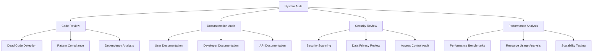
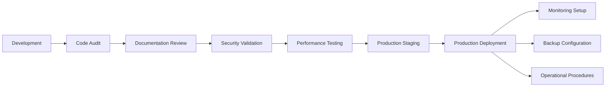

# Production Readiness & System Audit Design

## Overview

This design document outlines the approach for conducting a comprehensive system audit, cleaning up technical debt, and preparing the Codebase Gardener MVP for production deployment. The focus is on operational readiness, code quality, documentation completeness, and user experience polish.

## Architecture

### Audit and Review Framework



### Production Deployment Pipeline



## Components and Interfaces

### Code Audit Engine
- **Purpose**: Automated code quality analysis and cleanup recommendations
- **Interfaces**:
  - Static analysis integration (pylint, mypy, bandit)
  - Dead code detection and removal suggestions
  - Dependency analysis and optimization recommendations
- **Output**: Comprehensive audit report with actionable recommendations

### Documentation Validation System
- **Purpose**: Ensure documentation completeness and accuracy
- **Interfaces**:
  - Documentation testing (doctest integration)
  - Link validation and example verification
  - Structure and organization analysis
- **Output**: Documentation quality report with improvement suggestions

### Production Deployment Kit
- **Purpose**: Streamlined production deployment and configuration
- **Interfaces**:
  - Automated installation scripts
  - Environment configuration templates
  - Service management and monitoring setup
- **Output**: Production-ready deployment package

### Performance Validation Suite
- **Purpose**: Comprehensive performance testing and optimization validation
- **Interfaces**:
  - Load testing framework
  - Resource usage monitoring
  - Scalability analysis tools
- **Output**: Performance validation report with optimization recommendations

## Data Models

### Audit Report Structure
```python
@dataclass
class AuditReport:
    timestamp: datetime
    code_quality: CodeQualityMetrics
    documentation_status: DocumentationMetrics
    security_findings: List[SecurityIssue]
    performance_metrics: PerformanceMetrics
    recommendations: List[Recommendation]
    overall_score: float
```

### Production Readiness Checklist
```python
@dataclass
class ProductionReadinessChecklist:
    code_quality_passed: bool
    documentation_complete: bool
    security_validated: bool
    performance_verified: bool
    deployment_tested: bool
    monitoring_configured: bool
    backup_procedures_ready: bool
    operational_runbooks_complete: bool
```

## Error Handling

### Audit Process Error Handling
- **Graceful Degradation**: Continue audit even if individual checks fail
- **Comprehensive Reporting**: Include failed checks in audit report with error details
- **Recovery Procedures**: Provide clear steps to resolve audit failures

### Production Deployment Error Handling
- **Rollback Procedures**: Automated rollback on deployment failures
- **Health Checks**: Continuous health monitoring during deployment
- **Failure Notifications**: Immediate alerting on deployment issues

## Testing Strategy

### Audit Validation Testing
- **Unit Tests**: Test individual audit components
- **Integration Tests**: Validate complete audit workflow
- **Regression Tests**: Ensure audit accuracy over time

### Production Deployment Testing
- **Staging Environment**: Full production simulation
- **Smoke Tests**: Basic functionality validation post-deployment
- **Load Tests**: Production load simulation and validation

### Documentation Testing
- **Example Validation**: All code examples must execute successfully
- **Link Checking**: All documentation links must be valid
- **Completeness Testing**: Verify all features are documented
