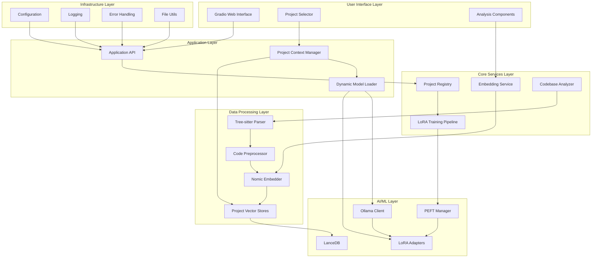

# Architecture Overview

## System Architecture

The Codebase Gardener MVP follows a modular, layered architecture designed for local-first processing with specialized AI models for each codebase project.



## Core Components

### User Interface Layer

#### Gradio Web Interface
- **Purpose**: Web-based user interface for project interaction
- **Technology**: Gradio framework for rapid UI development
- **Features**: Real-time updates, project switching, analysis display
- **Integration**: Connects to Application API for all functionality

#### Project Selector
- **Purpose**: Dropdown interface for switching between projects
- **Features**: Project status display, training progress, error states
- **Real-time Updates**: WebSocket-based updates for training progress
- **State Management**: Maintains UI state during project switches

### Application Layer

#### Application API
- **Purpose**: Central API layer coordinating all system components
- **Pattern**: Facade pattern hiding complexity from UI
- **Features**: Request routing, response formatting, error handling
- **Integration**: Orchestrates calls to core services

#### Project Context Manager
- **Purpose**: Manages conversation state and context for each project
- **Features**: Context switching, conversation history, session persistence
- **Memory Management**: Intelligent context pruning and caching
- **Concurrency**: Thread-safe context management for multiple users

#### Dynamic Model Loader
- **Purpose**: Efficiently loads and unloads LoRA adapters
- **Memory Strategy**: LRU caching with memory pressure response
- **Features**: Compatibility verification, fallback mechanisms
- **Performance**: Sub-2-second model switching target

### Core Services Layer

#### Project Registry
- **Purpose**: Central registry for all processed codebases
- **Data Store**: SQLite database with project metadata
- **Features**: Project lifecycle management, status tracking, fast lookup
- **Scalability**: Optimized for 10+ projects with sub-second queries

#### LoRA Training Pipeline
- **Purpose**: Automated training of project-specific LoRA adapters
- **Technology**: HuggingFace PEFT for parameter-efficient fine-tuning
- **Features**: Progress tracking, resource management, failure recovery
- **Optimization**: Background training with thermal management

#### Embedding Service
- **Purpose**: Coordinates embedding generation and similarity search
- **Technology**: Nomic Embed Code for code-specific embeddings
- **Features**: Batch processing, caching, performance optimization
- **Integration**: Works with vector stores for contextual retrieval

### Data Processing Layer

#### Tree-sitter Parser
- **Purpose**: Multi-language code parsing and AST generation
- **Languages**: Python, JavaScript, TypeScript, Java, Go, Rust
- **Features**: Syntax error handling, incremental parsing, metadata extraction
- **Output**: Structured code representations for embedding and training

#### Code Preprocessor
- **Purpose**: Code normalization and intelligent chunking
- **Strategy**: AST-based chunking at semantic boundaries
- **Features**: Language-specific processing, metadata extraction
- **Quality**: Maintains code context and relationships

#### Nomic Embedder
- **Purpose**: Generate high-quality code embeddings
- **Technology**: Nomic Embed Code model optimized for code
- **Features**: Batch processing, caching, similarity computation
- **Performance**: Optimized for Mac Mini M4 with batch sizes

### AI/ML Layer

#### Ollama Client
- **Purpose**: Interface to local Ollama LLM service
- **Features**: Connection management, model loading, inference
- **Reliability**: Retry logic, health checks, error recovery
- **Performance**: Persistent connections with connection pooling

#### PEFT Manager
- **Purpose**: Manages Parameter Efficient Fine-Tuning workflows
- **Technology**: HuggingFace PEFT library
- **Features**: LoRA adapter training, validation, deployment
- **Resource Management**: Memory-efficient training with progress tracking

#### LoRA Adapters
- **Purpose**: Project-specific model adaptations
- **Size**: 1-10MB per adapter (vs. 1-10GB for full models)
- **Features**: Fast loading/unloading, compatibility verification
- **Storage**: Organized by project with metadata

#### LanceDB Vector Store
- **Purpose**: Efficient vector storage and similarity search
- **Technology**: LanceDB for high-performance vector operations
- **Features**: Multi-tenant architecture, metadata filtering
- **Scalability**: Handles large codebases with sub-second search

## Data Flow Architecture

### Project Addition Flow
```
1. User selects codebase directory
2. Tree-sitter parses all code files
3. Code preprocessor chunks and normalizes
4. Nomic embedder generates embeddings
5. LanceDB stores vectors with metadata
6. PEFT manager trains LoRA adapter
7. Project registry records completion
8. UI updates with new project available
```

### Analysis Query Flow
```
1. User submits query in project context
2. Project context manager loads conversation history
3. Dynamic model loader ensures correct LoRA adapter
4. Embedding service converts query to vector
5. LanceDB performs similarity search
6. Ollama client generates response with context
7. Response includes project-specific insights
8. Context manager updates conversation history
```

### Project Switching Flow
```
1. User selects different project
2. Context manager saves current conversation
3. Dynamic model loader unloads current adapter
4. Model loader loads target project adapter
5. Context manager loads target conversation
6. Vector store switches to target project
7. UI updates to reflect new project context
```

## Memory Management Strategy

### Mac Mini M4 Constraints
- **Total RAM**: 8GB (base) / 16GB (upgraded)
- **Available for App**: ~4-6GB after system overhead
- **Target Usage**: <4GB for sustainable operation

### Memory Allocation
```
Base Ollama Model: ~2-4GB (depending on model size)
Active LoRA Adapter: ~10MB
Vector Store Cache: ~500MB
Conversation Context: ~50MB
Application Overhead: ~200MB
Total Target: <4GB
```

### Dynamic Loading Strategy
- **LRU Cache**: Keep 2-3 most recent LoRA adapters in memory
- **Predictive Loading**: Pre-load frequently switched projects
- **Memory Pressure**: Aggressive cleanup when approaching limits
- **Fallback**: Continue with base model if adapter loading fails

## Performance Characteristics

### Target Performance Metrics
- **Project Switching**: <2 seconds
- **Query Response**: <5 seconds for complex queries
- **Training Time**: <30 minutes for medium codebases
- **Memory Usage**: <4GB sustained operation
- **Startup Time**: <10 seconds cold start

### Optimization Strategies
- **Batch Processing**: Optimize embedding generation
- **Caching**: Intelligent caching at multiple layers
- **Lazy Loading**: Load components only when needed
- **Connection Pooling**: Reuse expensive connections
- **Thermal Management**: Monitor and throttle if needed

## Security Architecture

### Local-First Security
- **No External Calls**: All processing happens locally
- **Data Isolation**: Each project's data is isolated
- **File Permissions**: Proper access controls on data directories
- **Memory Safety**: Secure cleanup of sensitive data

### Data Protection
- **Encryption at Rest**: Optional encryption for sensitive projects
- **Access Controls**: User-level access to project data
- **Audit Logging**: Track access to sensitive operations
- **Secure Deletion**: Proper cleanup when projects are removed

## Scalability Considerations

### Project Scaling (10+ Projects)
- **Storage**: Linear growth in adapters and vector stores
- **Memory**: Constant through dynamic loading
- **Performance**: Logarithmic search with proper indexing
- **Management**: Efficient project registry with fast lookup

### Codebase Size Scaling
- **Large Projects**: Hierarchical chunking strategies
- **Incremental Updates**: Process only changed files
- **Memory Efficiency**: Stream processing for large files
- **Performance**: Parallel processing where possible

### Model Scaling
- **Larger Models**: Quantization and optimization techniques
- **Multiple Models**: Support for different base models
- **Specialized Models**: Domain-specific model support
- **Resource Management**: Dynamic resource allocation

## Error Handling Architecture

### Failure Modes
- **Model Loading Failures**: Fallback to base model
- **Training Failures**: Partial training with retry
- **Vector Store Failures**: Graceful degradation
- **Network Failures**: Offline operation capability

### Recovery Strategies
- **Automatic Retry**: Exponential backoff for transient failures
- **Graceful Degradation**: Reduced functionality vs. complete failure
- **User Notification**: Clear error messages with next steps
- **State Recovery**: Restore system state after failures

## Quality Assurance Architecture

### Dynamic Gap Closure Framework
As of Task 15, the system implements a two-phase gap closure mechanism to ensure continuous quality improvement:

#### Gap Management Process
- **Gap Validation Phase**: Each task begins by reviewing gaps from previous tasks that align with current scope
- **Gap Closure Phase**: Each task ends by addressing quick wins (<30min, low risk) before completion
- **Documentation**: All gaps tracked in `.kiro/docs/task_completion_test_log.md`
- **Decision Framework**: Detailed criteria in `.kiro/docs/gap-closure-criteria.md`

#### Quality Metrics
- **Target Gap Closure Rate**: >60% within 2 tasks of identification
- **Integration Health**: <2 integration gaps per task completion test
- **Quality Trend**: Decreasing gap count over time validates continuous improvement

#### Integration with Architecture
- **Component Testing**: Each component includes gap closure validation
- **Integration Testing**: System-wide gap closure prevents accumulation
- **Performance Monitoring**: Gap closure includes performance regression testing
- **Documentation**: Gap closure updates maintain architectural accuracy

## Integration Patterns

### Component Communication
- **Event-Driven**: Async communication between components
- **Message Passing**: Structured messages with type safety
- **Error Propagation**: Consistent error handling across layers
- **Logging**: Structured logging for debugging and monitoring
- **Gap Tracking**: Systematic gap identification and closure across all integrations

### External Integrations
- **Ollama**: REST API with connection management
- **File System**: Safe file operations with proper error handling
- **Configuration**: Environment variables and config files
- **Monitoring**: System resource monitoring and alerting
- **Quality Assurance**: Continuous gap closure and quality improvement