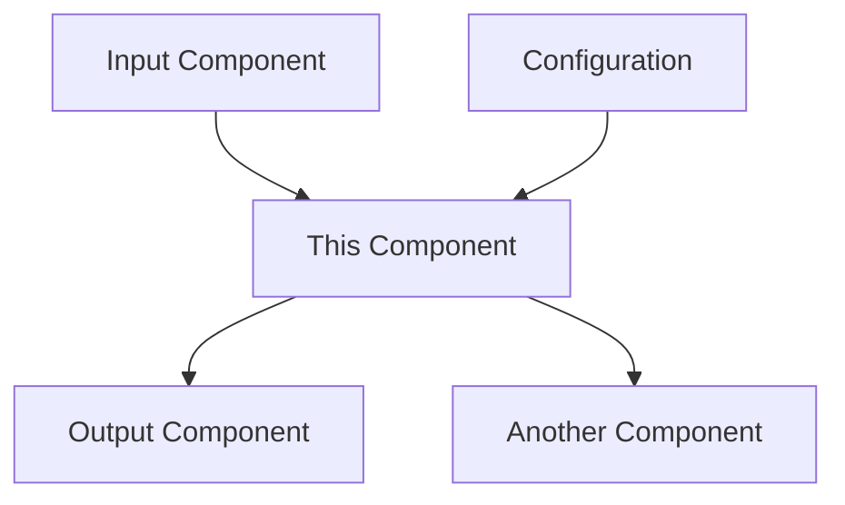
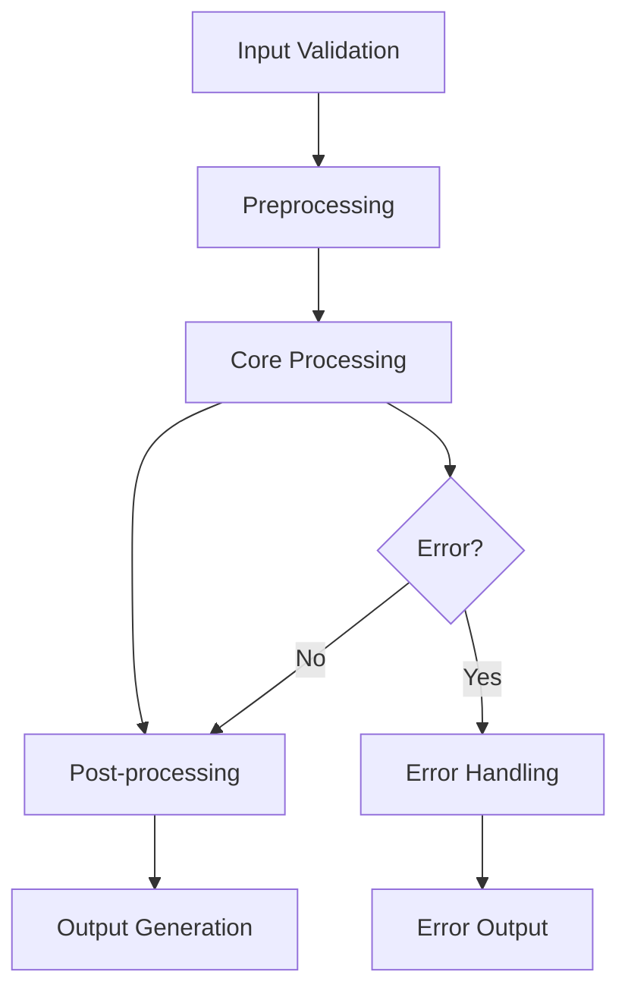

# [Component Name] Component Documentation

## Overview

### Purpose
[Detailed description of what this component does and why it exists in the system]

### Scope
[What this component is responsible for and what it is NOT responsible for]

### Position in Architecture
[How this component fits into the overall system architecture]



## Design Decisions

### Architectural Approach
[Explanation of the chosen architectural pattern and why]

### Technology Choices
- **Primary Technology**: [Technology] - [Rationale]
- **Supporting Libraries**: [Library] - [Purpose]
- **Alternative Considered**: [Alternative] - [Why not chosen]

### Trade-offs Made
1. **Trade-off 1**: [Description]
   - **Benefit**: [What was gained]
   - **Cost**: [What was sacrificed]
   - **Rationale**: [Why this trade-off was acceptable]

2. **Trade-off 2**: [Description]
   - **Benefit**: [What was gained]
   - **Cost**: [What was sacrificed]
   - **Rationale**: [Why this trade-off was acceptable]

## Component Structure

### Directory Layout
```
src/codebase_gardener/[component]/
├── __init__.py              # Public API exports
├── [main_module].py         # Core implementation
├── [helper_module].py       # Supporting functionality
├── exceptions.py            # Custom exceptions
├── types.py                 # Type definitions
└── config.py               # Component-specific configuration
```

### Key Classes and Modules

#### Core Classes
- **`[MainClass]`**: [Primary responsibility]
- **`[HelperClass]`**: [Supporting functionality]
- **`[ConfigClass]`**: [Configuration management]

#### Key Modules
- **`[main_module].py`**: [Purpose and key functions]
- **`[helper_module].py`**: [Purpose and key functions]

### Public API Surface
```python
# What users of this component should import
from codebase_gardener.[component] import (
    MainClass,          # Primary interface
    HelperFunction,     # Utility function
    ComponentError,     # Exception type
    ConfigType,         # Type definition
)
```

## Functionality

### Core Features
1. **Feature 1**: [Description and purpose]
2. **Feature 2**: [Description and purpose]
3. **Feature 3**: [Description and purpose]

### Input/Output Specifications

#### Input Data
```python
InputType = TypedDict('InputType', {
    'field1': str,           # Description of field1
    'field2': int,           # Description of field2
    'field3': Optional[bool] # Description of field3
})
```

#### Output Data
```python
OutputType = TypedDict('OutputType', {
    'result': str,           # Description of result
    'metadata': Dict[str, Any], # Additional information
    'status': Literal['success', 'error'] # Processing status
})
```

### Processing Flow


1. **Input Validation**: [Description of validation steps]
2. **Preprocessing**: [Description of preprocessing steps]
3. **Core Processing**: [Description of main processing logic]
4. **Post-processing**: [Description of post-processing steps]
5. **Output Generation**: [Description of output formatting]

## Configuration

### Configuration Schema
```python
ComponentConfig = TypedDict('ComponentConfig', {
    'setting1': str,         # Description and default
    'setting2': int,         # Description and default
    'setting3': bool,        # Description and default
    'advanced': Dict[str, Any] # Advanced settings
})
```

### Environment Variables
- `CODEBASE_GARDENER_[COMPONENT]_SETTING1`: [Description]
- `CODEBASE_GARDENER_[COMPONENT]_SETTING2`: [Description]
- `CODEBASE_GARDENER_[COMPONENT]_DEBUG`: Enable debug mode

### Configuration File
```yaml
[component]:
  setting1: "default_value"
  setting2: 42
  setting3: true
  advanced:
    batch_size: 32
    timeout: 30
    retry_count: 3
```

### Runtime Configuration
```python
# Dynamic configuration during runtime
component = ComponentClass()
component.configure({
    'setting1': 'runtime_value',
    'setting2': 100
})
```

## Dependencies

### Internal Dependencies
- **`codebase_gardener.config`**: Configuration management
- **`codebase_gardener.utils`**: Utility functions
- **`codebase_gardener.core.error_handling`**: Error handling framework

### External Dependencies
- **`[library_name]`** (`version`): [Purpose and usage]
- **`[another_library]`** (`version`): [Purpose and usage]

### Optional Dependencies
- **`[optional_library]`** (`version`): [Enhanced functionality when available]

## Integration Points

### Upstream Components
[Components that provide input to this component]

- **Component A**: [Type of data provided and interface]
- **Component B**: [Type of data provided and interface]

### Downstream Components
[Components that consume output from this component]

- **Component C**: [Type of data consumed and interface]
- **Component D**: [Type of data consumed and interface]

### Side Effects
[Any side effects this component has on the system]

- **File System**: [Files created, modified, or deleted]
- **Network**: [Network calls made]
- **Memory**: [Persistent memory usage]
- **State**: [Global state modifications]

## Error Handling

### Exception Hierarchy
```python
ComponentError(Exception)
├── ConfigurationError(ComponentError)
├── ProcessingError(ComponentError)
│   ├── ValidationError(ProcessingError)
│   └── TransformationError(ProcessingError)
└── ResourceError(ComponentError)
    ├── MemoryError(ResourceError)
    └── TimeoutError(ResourceError)
```

### Error Recovery Strategies
1. **Retry Logic**: [When and how retries are performed]
2. **Fallback Mechanisms**: [Alternative processing paths]
3. **Graceful Degradation**: [Reduced functionality modes]
4. **Error Propagation**: [How errors are passed to calling components]

### Error Logging
```python
# Error logging patterns used
logger.error(
    "Processing failed",
    extra={
        'component': '[component_name]',
        'input_size': len(input_data),
        'error_code': error.code,
        'context': error.context
    }
)
```

## Performance

### Performance Characteristics
- **Time Complexity**: [Big O notation for main operations]
- **Space Complexity**: [Memory usage patterns]
- **Throughput**: [Items processed per second]
- **Latency**: [Response time for typical operations]

### Benchmarks
| Operation | Small Input | Medium Input | Large Input |
|-----------|-------------|--------------|-------------|
| Process   | 10ms        | 100ms        | 1s          |
| Transform | 5ms         | 50ms         | 500ms       |
| Validate  | 1ms         | 10ms         | 100ms       |

### Mac Mini M4 Optimizations
- **Memory Management**: [Specific optimizations for 8GB constraint]
- **CPU Utilization**: [Multi-core usage patterns]
- **Thermal Considerations**: [Heat generation and mitigation]
- **Apple Silicon**: [ARM64 specific optimizations]

### Performance Monitoring
```python
# Performance monitoring code
import time
import psutil

def monitor_performance(func):
    def wrapper(*args, **kwargs):
        start_time = time.time()
        start_memory = psutil.Process().memory_info().rss
        
        result = func(*args, **kwargs)
        
        end_time = time.time()
        end_memory = psutil.Process().memory_info().rss
        
        logger.info(
            "Performance metrics",
            extra={
                'function': func.__name__,
                'duration': end_time - start_time,
                'memory_delta': end_memory - start_memory
            }
        )
        return result
    return wrapper
```

## Testing

### Test Coverage
- **Unit Tests**: [Coverage percentage and key test cases]
- **Integration Tests**: [Integration points tested]
- **Performance Tests**: [Performance benchmarks]
- **Error Handling Tests**: [Error scenarios covered]

### Test Structure
```
tests/
├── unit/
│   └── test_[component]/
│       ├── test_[main_class].py
│       ├── test_[helper_class].py
│       └── test_error_handling.py
├── integration/
│   └── test_[component]_integration.py
└── performance/
    └── test_[component]_performance.py
```

### Key Test Scenarios
1. **Happy Path**: [Normal operation with valid inputs]
2. **Edge Cases**: [Boundary conditions and unusual inputs]
3. **Error Conditions**: [Invalid inputs and failure scenarios]
4. **Performance**: [Load testing and resource usage]
5. **Integration**: [Interaction with other components]

### Mock Strategies
```python
# Common mocking patterns for this component
@pytest.fixture
def mock_dependency():
    with patch('[component].dependency') as mock:
        mock.return_value = expected_value
        yield mock

@pytest.fixture
def sample_input():
    return {
        'field1': 'test_value',
        'field2': 42,
        'field3': True
    }
```

## Monitoring and Observability

### Logging
```python
# Structured logging format
logger.info(
    "Component operation completed",
    extra={
        'component': '[component_name]',
        'operation': 'process',
        'input_size': len(input_data),
        'output_size': len(output_data),
        'duration': processing_time,
        'success': True
    }
)
```

### Metrics
- **Processing Rate**: Items processed per second
- **Error Rate**: Percentage of failed operations
- **Memory Usage**: Current and peak memory consumption
- **Response Time**: Average and 95th percentile response times

### Health Checks
```python
def health_check() -> Dict[str, Any]:
    """
    Component health check for monitoring systems.
    """
    return {
        'status': 'healthy',  # healthy, degraded, unhealthy
        'version': __version__,
        'dependencies': check_dependencies(),
        'memory_usage': get_memory_usage(),
        'last_error': get_last_error(),
        'uptime': get_uptime()
    }
```

## Security Considerations

### Input Validation
- **Sanitization**: [How inputs are cleaned and validated]
- **Size Limits**: [Maximum input sizes to prevent DoS]
- **Type Checking**: [Runtime type validation]

### Data Protection
- **Sensitive Data**: [How sensitive data is handled]
- **Encryption**: [Data encryption at rest and in transit]
- **Access Control**: [Who can access component functionality]

### Threat Model
1. **Malicious Input**: [Protection against crafted inputs]
2. **Resource Exhaustion**: [Protection against DoS attacks]
3. **Data Leakage**: [Prevention of information disclosure]

## Deployment

### Installation Requirements
- **Python Version**: 3.9+
- **System Requirements**: macOS (Mac Mini M4 optimized)
- **Dependencies**: [List of required packages]

### Configuration Deployment
```bash
# Environment setup
export CODEBASE_GARDENER_[COMPONENT]_SETTING1="production_value"

# Configuration file deployment
cp config/[component].prod.yaml ~/.codebase-gardener/config/
```

### Verification
```python
# Deployment verification script
from codebase_gardener.[component] import ComponentClass

def verify_deployment():
    try:
        component = ComponentClass()
        result = component.health_check()
        assert result['status'] == 'healthy'
        print("✓ Component deployed successfully")
    except Exception as e:
        print(f"✗ Deployment verification failed: {e}")
```

## Troubleshooting

### Common Issues
1. **Issue**: [Description of common problem]
   - **Symptoms**: [How to identify the issue]
   - **Cause**: [Root cause of the problem]
   - **Solution**: [Step-by-step resolution]

2. **Issue**: [Description of another common problem]
   - **Symptoms**: [How to identify the issue]
   - **Cause**: [Root cause of the problem]
   - **Solution**: [Step-by-step resolution]

### Debug Mode
```python
# Enable debug mode for detailed logging
component = ComponentClass(debug=True)
component.set_log_level('DEBUG')
```

### Diagnostic Tools
```python
# Component-specific diagnostic functions
def diagnose_component():
    """Run comprehensive component diagnostics."""
    return {
        'configuration': validate_configuration(),
        'dependencies': check_dependencies(),
        'performance': run_performance_test(),
        'memory': analyze_memory_usage()
    }
```

## Future Enhancements

### Planned Features
1. **Feature 1**: [Description and timeline]
2. **Feature 2**: [Description and timeline]
3. **Feature 3**: [Description and timeline]

### Technical Debt
1. **Debt Item 1**: [Description and plan to address]
2. **Debt Item 2**: [Description and plan to address]

### Scalability Improvements
- **Performance**: [Planned performance optimizations]
- **Memory**: [Memory usage improvements]
- **Concurrency**: [Better concurrent processing]

## Contributing

### Development Setup
```bash
# Set up development environment for this component
cd src/codebase_gardener/[component]/
pip install -e ".[dev]"
pytest tests/unit/test_[component]/
```

### Code Style
- Follow established patterns in the codebase
- Use type hints for all public APIs
- Include comprehensive docstrings
- Add unit tests for new functionality

### Pull Request Checklist
- [ ] Unit tests added/updated
- [ ] Integration tests pass
- [ ] Performance benchmarks maintained
- [ ] Documentation updated
- [ ] Memory usage within Mac Mini M4 constraints

---

**Component Version**: [Version]
**Last Updated**: [Date]
**Maintainer**: [Name/Team]