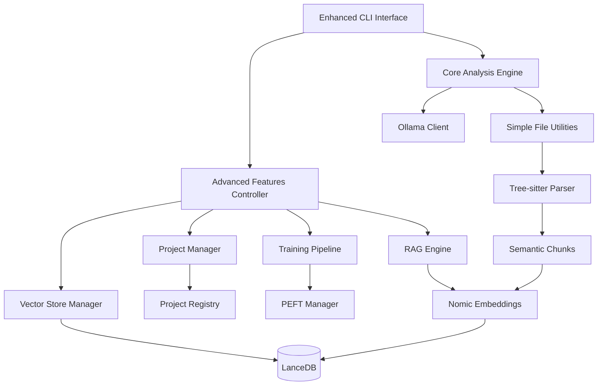

# Enhanced Codebase Auditor - Design Document

## Overview

The Enhanced Codebase Auditor evolves our current MVP CLI tool into a sophisticated RAG + LoRA training system while maintaining full backwards compatibility. The design follows a layered architecture with progressive enhancement, where advanced features are dynamically loaded and gracefully degrade to simple mode when unavailable.

The system reactivates and integrates existing disabled components from `src/codebase_gardener_DISABLED/` rather than building from scratch, leveraging the comprehensive infrastructure already developed for project management, vector storage, and model training.

## Architecture

### High-Level System Architecture



### Layered Architecture Design

#### Layer 1: Core CLI (Always Available)
- **Current MVP CLI**: `codebase_auditor.py` remains the main entry point
- **Simple File Processing**: Existing `SimpleFileUtilities` for basic analysis
- **Direct Ollama Integration**: Current chat and analysis functionality
- **Backwards Compatibility**: All existing commands work unchanged

#### Layer 2: Enhancement Controller (Dynamic Loading)
- **Feature Detection**: Determines when advanced features are available/beneficial
- **Graceful Fallbacks**: Handles failures in advanced components
- **Resource Management**: Monitors memory and compute constraints
- **Mode Switching**: Seamlessly transitions between simple and advanced modes

#### Layer 3: Advanced Components (Reactivated from Disabled)
- **Project Management**: Persistent project state and metadata
- **Vector Storage**: LanceDB-based semantic search
- **Training Pipeline**: LoRA adapter creation and management
- **RAG Engine**: Context retrieval and response enhancement

## Components and Interfaces

### Core Component Integration

#### Enhanced CLI Interface
```python
class EnhancedCodebaseAuditor(CodebaseAuditor):
    """Extended auditor with advanced capabilities"""

    def __init__(self, enable_advanced: bool = True):
        super().__init__()
        self.advanced_controller = None
        if enable_advanced:
            try:
                self.advanced_controller = AdvancedFeaturesController()
            except ImportError:
                logger.warning("Advanced features unavailable, using simple mode")

    def analyze_codebase(self, directory_path: str, advanced: bool = False):
        """Enhanced analysis with optional advanced features"""
        if advanced and self.advanced_controller:
            return self.advanced_controller.analyze_with_rag(directory_path)
        return super().analyze_codebase(directory_path)

    def chat(self, question: str, use_context: bool = True):
        """Enhanced chat with optional RAG context"""
        if use_context and self.advanced_controller:
            return self.advanced_controller.chat_with_context(question)
        return super().chat(question)
```

#### Advanced Features Controller
```python
class AdvancedFeaturesController:
    """Orchestrates advanced features with graceful fallbacks"""

    def __init__(self):
        self.project_manager = ProjectManager()
        self.vector_store_manager = ProjectVectorStoreManager()
        self.training_pipeline = TrainingPipeline()
        self.rag_engine = RAGEngine()
        self.current_project = None

    def analyze_with_rag(self, directory_path: str) -> str:
        """Perform analysis with RAG enhancement"""
        try:
            # Create or load project
            project = self.project_manager.get_or_create_project(directory_path)

            # Process code with semantic chunking
            chunks = self._process_codebase(directory_path)

            # Store in vector database
            self.vector_store_manager.store_chunks(project.id, chunks)

            # Generate enhanced analysis
            return self.rag_engine.generate_analysis(project.id, chunks)

        except Exception as e:
            logger.error(f"Advanced analysis failed: {e}")
            # Fallback to simple analysis
            return self._fallback_to_simple_analysis(directory_path)
```

### Data Models

#### Project Context
```python
@dataclass
class ProjectContext:
    """Enhanced project context with persistent state"""
    project_id: str
    name: str
    source_path: Path
    vector_store_path: Path
    lora_adapter_path: Optional[Path]
    conversation_history: List[ChatMessage]
    analysis_cache: Dict[str, Any]
    training_status: TrainingStatus
    last_updated: datetime

    def is_enhanced(self) -> bool:
        """Check if project has advanced features active"""
        return self.vector_store_path.exists()

    def has_trained_model(self) -> bool:
        """Check if project has a trained LoRA adapter"""
        return self.lora_adapter_path and self.lora_adapter_path.exists()
```

#### Enhanced Code Chunk
```python
@dataclass
class EnhancedCodeChunk:
    """Semantic code chunk with metadata"""
    id: str
    content: str
    file_path: Path
    start_line: int
    end_line: int
    chunk_type: ChunkType  # function, class, module, etc.
    language: str
    complexity_score: float
    dependencies: List[str]
    embedding: Optional[np.ndarray]
    metadata: Dict[str, Any]

    def to_training_example(self) -> Dict[str, Any]:
        """Convert to training data format"""
        return {
            "input": f"Analyze this {self.language} {self.chunk_type.value}:\n{self.content}",
            "output": self._generate_analysis_target(),
            "metadata": self.metadata
        }
```

### Integration Interfaces

#### RAG Engine Interface
```python
class RAGEngine:
    """Retrieval-Augmented Generation engine"""

    def __init__(self, vector_store_manager: ProjectVectorStoreManager):
        self.vector_store_manager = vector_store_manager
        self.embedding_model = NomicEmbeddings()

    def retrieve_context(self, project_id: str, query: str, limit: int = 5) -> List[EnhancedCodeChunk]:
        """Retrieve relevant code chunks for query"""
        query_embedding = self.embedding_model.embed_query(query)
        return self.vector_store_manager.search_similar(project_id, query_embedding, limit)

    def generate_enhanced_response(self, query: str, context: List[EnhancedCodeChunk], model: str) -> str:
        """Generate response with retrieved context"""
        context_text = self._format_context(context)
        enhanced_prompt = f"""
        Based on the following code context from this project:

        {context_text}

        User question: {query}

        Provide a detailed, project-specific answer:
        """
        return self._call_model(enhanced_prompt, model)
```

## Data Flow

### Simple Mode Data Flow
```
User Input → CLI Command → SimpleFileUtilities → File Content → Ollama → Response
```

### Advanced Mode Data Flow
```
User Input → CLI Command → AdvancedController → ProjectManager → TreeSitterParser →
SemanticChunks → NomicEmbeddings → LanceDB → RAGEngine → EnhancedPrompt →
Ollama+LoRA → EnhancedResponse
```

### Training Pipeline Data Flow
```
SemanticChunks → TrainingDataPreparator → PEFTManager → LoRATraining →
AdapterStorage → ModelRegistry → DynamicLoading
```

## Error Handling

### Graceful Degradation Strategy

#### Component Failure Handling
```python
class GracefulFallbackMixin:
    """Mixin for graceful fallback behavior"""

    def with_fallback(self, advanced_func: Callable, simple_func: Callable, *args, **kwargs):
        """Execute advanced function with fallback to simple"""
        try:
            return advanced_func(*args, **kwargs)
        except Exception as e:
            logger.warning(f"Advanced feature failed, falling back: {e}")
            return simple_func(*args, **kwargs)

    def require_component(self, component_name: str, component: Any):
        """Ensure component is available or raise clear error"""
        if component is None:
            raise ComponentUnavailableError(
                f"{component_name} is not available. "
                f"Install dependencies or use simple mode."
            )
```

#### Error Recovery Patterns
1. **Import Failures**: Fall back to simple mode with clear messaging
2. **Memory Constraints**: Unload components and retry with reduced functionality
3. **Training Failures**: Continue with base model, log for later retry
4. **Vector Store Issues**: Fall back to simple analysis, attempt repair
5. **Model Loading Errors**: Use base model, notify user of degraded performance

## Testing Strategy

### Test Architecture

#### Unit Testing
- **Component Isolation**: Test each advanced component independently
- **Fallback Testing**: Verify graceful degradation in all failure scenarios
- **Interface Compatibility**: Ensure backwards compatibility with existing CLI
- **Resource Management**: Test memory and compute constraint handling

#### Integration Testing
- **End-to-End Workflows**: Test complete simple → advanced → training cycles
- **Cross-Component Communication**: Verify proper data flow between components
- **Performance Benchmarks**: Ensure response times meet requirements
- **Resource Usage**: Verify memory usage stays within Mac Mini M4 constraints

#### System Testing
- **Real Codebase Testing**: Test with actual projects of varying sizes
- **Long-Running Sessions**: Test memory leaks and resource cleanup
- **Failure Recovery**: Test system behavior under various failure conditions
- **User Experience**: Verify CLI remains intuitive with advanced features

### Test Data Strategy
```python
class TestDataManager:
    """Manages test data for comprehensive testing"""

    @classmethod
    def get_test_codebases(cls) -> List[TestCodebase]:
        """Provide variety of test codebases"""
        return [
            TestCodebase("small_python", size="<1MB", files=10, complexity="low"),
            TestCodebase("medium_js", size="5MB", files=100, complexity="medium"),
            TestCodebase("large_mixed", size="20MB", files=500, complexity="high"),
        ]

    @classmethod
    def get_performance_benchmarks(cls) -> Dict[str, Benchmark]:
        """Define performance benchmarks"""
        return {
            "vector_search": Benchmark(max_latency="200ms", min_accuracy=0.8),
            "training_time": Benchmark(max_duration="30min", min_improvement=0.1),
            "memory_usage": Benchmark(max_memory="6GB", cleanup_threshold=0.9),
        }
```

## Implementation Phases

### Phase 1: Foundation Reactivation (Week 1-2)
**Goal**: Reactivate disabled components with basic integration

**Tasks**:
1. Move components from `src/codebase_gardener_DISABLED/` to `src/codebase_gardener/`
2. Fix imports and resolve dependency issues
3. Create `AdvancedFeaturesController` with graceful fallbacks
4. Add basic integration points to existing CLI
5. Implement comprehensive error handling and logging

**Success Criteria**:
- All existing CLI functionality remains unchanged
- Advanced components can be imported without errors
- Graceful fallback to simple mode when advanced features fail
- Basic project creation and management works

### Phase 2: RAG Integration (Week 3-4)
**Goal**: Add semantic analysis and context retrieval

**Tasks**:
1. Integrate Tree-sitter parsing with existing file discovery
2. Implement semantic chunking and embedding generation
3. Set up LanceDB vector storage with project isolation
4. Create RAG engine for context retrieval
5. Add `--advanced` flag to existing `analyze` command

**Success Criteria**:
- Code is parsed into semantic chunks with metadata
- Embeddings are generated and stored in vector database
- Context retrieval works with <200ms latency
- Enhanced analysis provides more specific, contextual responses
- Memory usage stays within 4GB during processing

### Phase 3: Training Pipeline (Week 5-6)
**Goal**: Enable LoRA training for project-specific models

**Tasks**:
1. Activate PEFT manager and training pipeline
2. Implement training data preparation from semantic chunks
3. Add background training with progress tracking
4. Create model management and dynamic loading
5. Add `train` and `project-status` commands to CLI

**Success Criteria**:
- LoRA training completes within 30 minutes for typical projects
- Trained models show measurable improvement over base model
- Training runs in background without blocking user interaction
- Model switching happens seamlessly
- Training failures are handled gracefully

### Phase 4: Continuous Improvement (Week 7-8)
**Goal**: Add feedback collection and automatic improvement

**Tasks**:
1. Implement feedback collection mechanisms (thumbs up/down, ratings)
2. Add automatic retraining triggers based on code changes
3. Create A/B testing framework for model improvements
4. Optimize performance and resource usage
5. Add comprehensive monitoring and health checks

**Success Criteria**:
- User feedback is collected and stored for training improvement
- Automatic retraining triggers work reliably
- A/B testing correctly identifies model improvements
- System performance is optimized for Mac Mini M4
- Health monitoring provides actionable insights

## Resource Management

### Memory Management Strategy
```python
class ResourceManager:
    """Manages system resources for optimal performance"""

    def __init__(self, max_memory_gb: float = 6.0):
        self.max_memory_gb = max_memory_gb
        self.component_cache = LRUCache(maxsize=3)
        self.memory_monitor = MemoryMonitor()

    def load_component(self, component_type: str, project_id: str):
        """Load component with memory management"""
        if self.memory_monitor.get_usage() > self.max_memory_gb * 0.8:
            self._cleanup_unused_components()

        component = self.component_cache.get((component_type, project_id))
        if component is None:
            component = self._create_component(component_type, project_id)
            self.component_cache[(component_type, project_id)] = component

        return component

    def _cleanup_unused_components(self):
        """Free memory by unloading unused components"""
        # Implement LRU eviction and garbage collection
        pass
```

### Performance Optimization
- **Lazy Loading**: Components loaded only when needed
- **Streaming Processing**: Large codebases processed in chunks
- **Caching Strategy**: Intelligent caching of embeddings and model states
- **Background Processing**: Training and indexing happen asynchronously
- **Resource Monitoring**: Continuous monitoring with automatic cleanup

This design provides a robust foundation for evolving the MVP CLI into a sophisticated RAG + training system while maintaining simplicity, reliability, and backwards compatibility.
